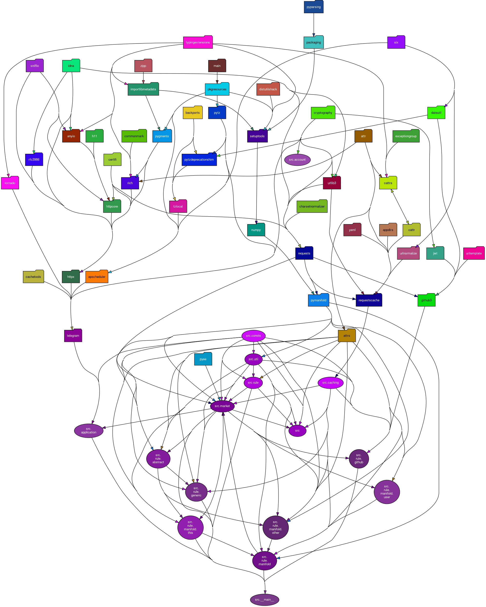

# Market Manager for Manifold

[](https://badge.fury.io/py/manifoldmarketmanager)   [](https://github.com/LivInTheLookingGlass/ManifoldMarketManager/blob/master/LICENSE) 

[   ](https://codeclimate.com/github/LivInTheLookingGlass/ManifoldMarketManager) [](https://dl.circleci.com/status-badge/redirect/gh/LivInTheLookingGlass/ManifoldMarketManager/tree/master)

What you're reading is only one of many places I host this code at. They are:
- [GitHub](https://github.com/LivInTheLookingGlass/ManifoldMarketManager)
- [GitLab](https://gitlab.com/LivInTheLookingGlass/ManifoldMarketManager)
- [TildeGit](https://tildegit.org/LivInTheLookingGlass/ManifoldMarketManager)

## Currently Implemented

- Resolve a market based on a GitHub PR
    - Both "does it merge" and "how long did it take to merge"
- Resolve a market based on its close date and current answer
- Resolve a market based on any logical combination of implemented rules
- Resolve market randomly, like in a lottery
    - Several methods implemented, including:
    - Random value
    - Random index
        - Weighted or unweighted
        - Excluding early indices if wanted
        - Only including the first N indices if wanted
    - Can also specify the method, arguments yourself
- Automatically formats rules for the market type
- Before resolving a market, reach out on Telegram to confirm that's okay

## Application Behavior

Every time you run `example.py`, it goes through the following steps:

1. (TODO) If flagged, scan a JSON file
    1. For each entry:
        1. If it's a market creation request, add it to `pending`
        2. If it's an existing market, add it to `markets`
    2. Clear the file
2. (TODO) Unless flagged otherwise, for each market in `pending`:
    1. Check your balance
    2. If it's less than M$100, break
    3. If it's less than the `cost` of this market, continue
    4. Create the market
    5. Add it to `markets`
    6. Remove it from `pending`
3. If flagged, manually remove many markets from `markets`
4. If flagged, manually add a market to `markets`
5. Unless flagged otherwise, for each market in `markets`:
    1. If the time is before `last_checked + check_rate` and refresh is not flagged, continue
    2. If the market does not meet the resolution criteria, continue
    3. Ask the operator what action to take (either via Telegram or the console):
        1. Cancel it, or
        2. Resolve to the suggested value, or
        3. Do nothing
    4. Update check time

## Database Spec

- `markets`
    - `id`: INTEGER
    - `market`: A serialized python object with the relevant rules
    - `check_rate`: REAL, the minimum number of hours between checks
    - `last_checked`: TIMESTAMP, the time it was last checked (or NULL)
- `pending`
    - `id`: INTEGER
    - `priority`: REAL, lower means you get created sooner
    - `cost`: INTEGER, cost in mana to create, lower means you get created sooner
    - `request`: A serialized python object with the relevant rules and info

## Immediate Goals

- [x] Make test for each untested function in PyManifold
- [ ] move `example_json` into main library
- [ ] write tests for whatever comes of `example_json`
- [ ] Make an API to import JSON markets without creating one
- [ ] test `from_dict` of rule, subclasses
    - [x] test `from_dict` of rule
    - [x] test `from_dict` of defaultable subclasses
    - [ ] test `from_dict` of non-defaultable subclasses
- [ ] test `__main__` by monkeypatching the `main()` function
- [ ] disable warning about default explain_specific if classvar acknowledges default behavior as intended
- [ ] Make comparison rules (>, <, etc)
- [x] test GitHub rules using real examples
- [x] test register_db
- [x] test ManifoldMarketMixin (done implicitly via the Other rules)
- [x] test manifold user rules using real examples
- [x] test manifold this rules using real examples
- [x] test manifold other rules using real examples
- [ ] test market.py (1/8)
  - [x] from_url
  - [ ] explain_abstract
  - [ ] explain_specific
  - [ ] current answer
  - [ ] should_resolve
  - [ ] resolve_to
  - [ ] resolve
  - [ ] cancel
- [ ] test abstract.py (0/3)
  - [ ] abstractrule subclass enforcement
  - [ ] explain_abstract
  - [ ] explain_specific
- [ ] test generic.py (3/5)
  - [x] modulus
  - [x] sum
  - [x] product
  - [ ] random index
  - [ ] multiple values
- [x] test util.py
- [x] use pyee to enable events on markets
- [ ] add a submodule for scanners
- [ ] add a hook to insert preambles in explain_specific()
- [ ] figure out how to make myself show up on leaderboard even if not placed
- [ ] Truth table rule
For N markets, make 2^N choices
If any component market resolves PROB, treat it as a superposition, so (p|YES, y, z> + [1-p]|NO, y, z>)

    If any component resolves to CANCEL, either cancel the whole market or resolve to it as a 50/50 superposition

    So this is a Rule[MultipleChoiceResolution] whose children are Rule[BinaryResolution] (specifically OtherMarketValue[BinaryResolution])
- [ ] support multiple accounts by prepending username to table names, or adding username field
- [ ] move confirmation code to own file, one for console, one for telegram, and an extra (Null) that implements the protocol as an example

## Future Goals

The goal of this project is to make a Manifold agent that can manage various forms of markets. Currently targeted are:

1. Mirror markets on another service
    - Include ability to do this for future markets via regex or tag matching
    - Example: Election markets
2. Future Discount Markets
    - Automatically make markets that resolve at a variety of different dates
    - Offer a link that charts the future discount based off of these markets
3. Ethereum/Python Improvement Proposals
    - Automatically make markets for whether a PEP or EIP is accepted
    - Resolve when the associated issue has been closed for some amount of time
    - Might be able to just resolve to round(MKT), honestly
        - Maybe use this instead as a flag for error, if ex: pull request accepted but round(MKT)=0, flag for attention
    - Actually, this might look like a generic Pull Request -> Manifold Market bridge
        - If so, make some for every Manifold PR
4. Box Office Futures Markets
    - Note that this could include Rotten Tomatoes scores as well
    - Feels easily queryable
    - Feels like movies from major studios could be fetched fairly easily
5. Rotten Tomatoes Markets
    - Make it for 1, 4, 10 weeks after release
    - Use https://pypi.org/project/rotten-tomatoes-scraper/
5. Markets for OSM campaigns and bounties
6. Conditional Markets
7. Does a US Congress bill pass?
    - Use https://sunlightlabs.github.io/congress/bills.html
    - Resolve to YES iff history.enacted
    - Resolve to NO iff not history.enacted and not history.active

## How to Run/Contribute

1. First, make sure you are running Python >= 3.7
2. Load the submodules
3. Run `make dependencies`
4. Make a file called `env_<name>.sh`. It should contain a max of 7 exports
    1. `ManifoldAPIKey`: The API key for managing your Manifold markets. See [here](https://docs.manifold.markets/api) for instructions on how to retrieve it.
    2. `DBName`: The name of your database file
    3. `LogFile`: The name of a logfile to use
    4. `TelegramAPIKey`: The API key for your Telegram bot. For more info, see [here](https://github.com/python-telegram-bot/python-telegram-bot/wiki/Introduction-to-the-API)
    5. `TelegramChatID`: The chat ID between your Telegram bot and you. For more info, see [here](https://github.com/python-telegram-bot/python-telegram-bot/wiki/Introduction-to-the-API)
    6. `GithubAccessToken`: The Personal Access Token for reading GitHub issues and pull requests. Strictly speaking not needed, and it will try to fall back to unauthorized requests, but that isn't always feasible.
    7. `GithubUsername`: See above
5. Add your first markets using the arguments provided in `src/__main__.py`. Each market needs at least one DoResolveRule and at least one ResolveToRule. The simplest ResolveToRule is `--round` or `--current`. The simplest DoResolve rule is `--rel-date`. More complicated markets may need to have rules constructed manually.
6. When you've added all your markets, modify the polling frequency in `daemon.sh`, then run `make daemon`

## Dependencies



## JSON Examples

### 50/50 Lottery

```javascript
{
    "manifold": {
        "outcomeType": "FREE_RESPONSE",
        "question": "Manifold 50/50 #3",
        "description": {  // Uses TipTap formatting :(
            "type": "doc",
            "content": [
                {
                    "type": "paragraph",
                    "content": [
                        {
                            "type": "text",
                            "text": "This question resolves to a 50% share between the subsidy and one other entry chosen randomly (weighted by probability)."
                        }
                    ]
                },
                {
                    "type": "paragraph",
                    "content": [
                        {
                            "type": "text",
                            "text": "I will periodically add to the subsidy such that it has value at least 25% of the non-subsidy options."
                        }
                    ]
                }
            ],
            "processed": false  // This tells the program to append explain_abstract()
        },
        "closeTime": "2022-09-12T11:59:59"  // Doesn't necessarily need the time
    },
    // all rules are serialized as a two item array
    // the first entry is the name of the rule relative to the `rule.py` file
    // the second entry is a dictionary of keyword arguments for the rule
    "time_rules": [  // rules for when to resolve a market
        [
            "manifold.this.ThisMarketClosed",
            {}
        ]
    ],
    "value_rules": [  // rules for what to resolve to
        [
            "generic.ResolveMultipleValues",
            {
                "shares": [  // format: [<serialized rule>, <relative weight>]
                    [
                        [
                            "generic.ResolveToValue",
                            {"resolve_value": 0}
                        ],
                        1
                    ],
                    [
                        [
                            "generic.ResolveRandomIndex",
                            {
                                "start": 1,
                                "seed": "feijwaopfewa"
                            }
                        ],
                        1
                    ]
                ]
            }
        ]
    ],
    "notes": "",
    "initial_values": {  // Used in free response / multiple choice to set initial answers
        "Subsidy": 50,
        "Example Ticket": 1
    }
}
```

### Pseudonumeric Example

```javascript
{
    "manifold": {
        "outcomeType": "PSEUDO_NUMERIC",
        "question": "When will the next mission to Kuiper Belt be launched?",
        "description": {
            "type": "doc",
            "content": [
                {
                    "type": "paragraph",
                    "content": [
                        {
                            "type": "text",
                            "text": "Resolves to the fractional year at which a mission to the Kuiper Belt is launched. This includes any body in the Kuiper Belt that is not considered a major planet or in orbit of a major planet."
                        }
                    ]
                }
            ],
            "processed": true  // tells the application to NOT add explanatory text
        },
        "closeTime": "2100-12-31T11:59:59",
        "minValue": 2023,
        "maxValue": 2100,
        "isLogScale": true,
        "initialValue": 2035
    },
    "time_rules": [
        [
            "manifold.this.ThisMarketClosed",
            {}
        ]
    ],
    "value_rules": [
        ["manifold.this.CurrentValueRule", {}]
    ],
    "notes": ""
}
```

### Mutliple Choice Example

```javascript
{
    "manifold": {
        "outcomeType": "MULTIPLE_CHOICE",
        "question": "Which character is best?",
        "description": {
            "type": "doc",
            "content": [
                {
                    "type": "paragraph",
                    "content": [
                        {
                            "type": "text",
                            "text": "This market is purely intended as a poll to try and settle an argument. It will resolve to MKT."
                        }
                    ]
                }
            ],
            "processed": false
        },
        "answers": [
            "Harry Potter",
            "Cthulu",
            "Ririsu/Ririto Ibusuki",
        ],
        "closeTime": "2022-09-13T11:59:59"
    },
    "time_rules": [
        [
            "manifold.this.ThisMarketClosed",
            {}
        ]
    ],
    "value_rules": [
        [
            "manifold.this.CurrentValueRule",
            {}
        ]
    ],
    "notes": ""
}
```

### GitHub PR Merge Date

```javascript
{
    "manifold": {
        "outcomeType": "PSEUDO_NUMERIC",
        "question": "How many days after Septermber 1st will Manifold PR#830 be merged?",
        "description": {
            "type": "doc",
            "content": [
                {
                    "type": "paragraph",
                    "content": [
                        {
                            "type": "text",
                            "text": "Resolves to MAX if rejected at time of check"
                        }
                    ]
                }
            ],
            "processed": false
        },
        "closeTime": "2025-05-28T11:59:59",
        "minValue": 0,
        "maxValue": 1000,
        "isLogScale": true,
        "initialValue": 30.639
    },
    "time_rules": [
        [
            "manifold.this.ThisMarketClosed",
            {}
        ],
        [
            "github.ResolveWithPR",
            {
                "owner": "manifoldmarkets",
                "repo": "manifold",
                "number": 830
            }
        ]
    ],
    "value_rules": [
        [
            "github.ResolveToPRDelta",
            {
                "owner": "manifoldmarkets",
                "repo": "manifold",
                "number": 830,
                "start": "2022-09-01"
            }]
    ],
    "notes": ""
}
```

### Derivative Market Example

```javascript
{
    "manifold": {
        "outcomeType": "BINARY",
        "question": "(ABC does not call control of the House by midnight PT on election day) == (control will go to Democrats)",
        "description": {
            "type": "doc",
            "content": [],
            "processed": false
        },
        "closeTime": "2100-12-31T11:59:59",
        "initialProb": 50
    },
    "time_rules": [
        ["manifold.this.ThisMarketClosed", {}],
        ["generic.BothRule", {
            "rule1": ["manifold.other.OtherMarketResolved", {"url": "https://manifold.markets/BoltonBailey/will-abc-news-call-control-of-the-h"}],
            "rule2": ["manifold.other.OtherMarketResolved", {"url": "https://manifold.markets/BoltonBailey/will-democrats-maintain-control-of"}]
        }]
    ],
    "value_rules": [
        [
            "generic.XNORRule",
            {
                "rule1": [
                    "generic.NegateRule",
                    {"child": ["manifold.other.OtherMarketValue", {"url": "https://manifold.markets/BoltonBailey/will-abc-news-call-control-of-the-h"}]}
                ],
                "rule2": ["manifold.other.OtherMarketValue", {"url": "https://manifold.markets/BoltonBailey/will-democrats-maintain-control-of"}]
            }
        ]
    ],
    "notes": ""
}
```
